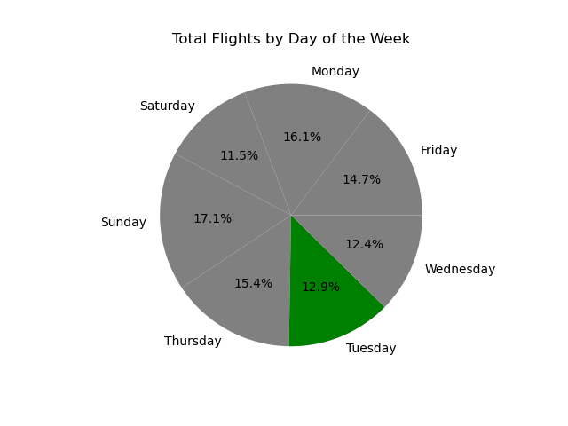

# Project: Predicting Flight Prices Based on Various Criteria

## Project Description/Outline: 

An overall analysis of flight prices will be conducted, followed by a deeper look at the relationship between flight price and several other variables (including date of flight, starting airport, destination airport, duration of flight, etc.).  Based on these findings, further analysis of prices within each of these categories will be conducted as needed. 

## Methodology

* The script was coded using Jupyter notebook. The libraries used were Pandas, Matplotlib, NumPy, and SciPy.

* Our project folder contains:
    * A Jupyter notebook named `flight.ipynb` to run the analysis.
    * A `Resources` folder that contains the CSV files downloaded in from open data websites (under `Notes and Resources` below)
    * An `Image-Output` folder that contains the various visualizations created by the analysis

## Notes and Resources

* Datasets to Be Used: https://www.kaggle.com/datasets/dilwong/flightprices 
This dataset is a CSV file where each row is a purchasable ticket found on Expedia between 2022-04-16 and 2022-10-05, to/from the following airports: ATL, DFW, DEN, ORD, LAX, CLT, MIA, JFK, EWR, SFO, DTW, BOS, PHL, LGA, IAD, OAK.

## Data pre-processing/gathering steps (cleaning and manipulation)

* Due to the size of the dataset only two months will be considered for analysis. 
* Columns were removed and renamed to organize and limit the information only to variables to interest.
* Only economy/coach flights were considered in this analysis.
* Data types were changed to enable analysis.
* Units were converted (example:seconds to minutes) for practicality.

## Questions and Observations
 
### Which variable/s has/have the strongest association with flight price?

- The data was unclear regarding which had the strongest association.

### Which variable/s has/have the weakest association with flight price?

- The correlation between cost and the difference between purchase date and flight date had the weakest correlation. 

### Can flight price be predicted based on any of these variables?

- None of the linear regression models were reliable due to low correlation coefficients ® and coefficients of determination (r-squared).  While models were created that can make predictions, the predictions that would be made would not be able to be trusted.

### Which airports are most expensive to fly to/from?

- San Francisco was the most expensive airport to fly to; Oakland and LaGuardia were the least expensive to fly from and to, respectively.

### Is it cheaper to fly in the am/pm? Hypothesis testing.

- Time of day was not a large factor in the cost of a flight, although 1 AM was consistently the most expensive time to fly, on average.

### What day is cheapest to fly on?

- Based on median cost, the cheapest day to fly is Tuesday.

# Summary 

The distribution of flight prices was unimodal and heavily skewed to the right.  On average, based on the median, flights during this time cost approximately $217.60.  Based on the IQR, the middle 50% of costs varied by at most $171; however the total range of costs was much higher ($2,155.63) due to several flights that cost an unusually high amount.  The most expensive of these outlier flights cost $2,179.60.

Parallel box plots were used to analyze the relationship between flight cost and each of the following categorical variables: departure airport, arrival airport, airline, day of the week.  Within each of these categories, each airport and each airline had multiple flights that were outliers (meaning they cost an unusually high amount compared to other flights to/from that airport/run by that airline).  These box plots are included in the provided code.  Based on the median costs, San Francisco International Airport was the most expensive airport (both to fly to and to fly from).  Oakland was the least expensive to depart from, while LaGuardia was the least expensive to arrive at.  This information could be helpful to individuals who wish to fly somewhere from an area of California that is close to both San Francisco and Oakland (the two airports are only 29 miles apart); based solely on cost they may opt for Oakland over San Francisco.  Similarly, individuals who are traveling to the New York area may choose to fly to LaGuardia over other airports (there are several within an hour or two of LaGuardia) in order to save money.  When looking at different airlines, most of the average costs were similar to each other, although Alaska Air did end up having the highest median cost ($258.60).  Frontier Airlines did stand out as being noticeably more affordable, with a median cost of $111.68.  If travelers are looking to save money, and a flight is available, Frontier Airlines is likely to be the cheapest option available.  In terms of which day of the week tended to be the most expensive and least expensive day, on average Sunday was the most expensive day to fly while Tuesday was the least expensive.

Scatter plots were used to analyze the relationship between flight cost and each of the following quantitative variables: total travel distance, length of flight, number of days ahead of time that purchase was made.  Based on the scatter plots, none of these variables appeared to have a strong correlation with flight cost.  The weakest of the three was the difference between flight date and purchase date.  For both travel distance and length of flight, a regression analysis was run and produced coefficients of determination (r-squared values) of .2632 and .2289, respectively.  This means that less than 30% of the variation in flight cost could be accounted for by variation in either of those variables.  Least square regression lines were created for both models and will be analyzed here, but it should be noted that neither of these equations will likely be reliable predictors of cost since the correlation is so weak.  First the equation predicting cost from total travel distance implies that if one does not travel anywhere (a distance of zero) the flight is expected to cost $134.93 and that for each additional mile the cost of the flight is expected to increase by $0.11.  The equation predicting cost from the length of the flight predicts that a flight that is zero minutes long will cost $99.70 and that for each additional minute a flight is expected to be $0.82 more expensive.  Both of the previously mentioned y-intercepts ($134.93 and $99.70) are not reliable interpretations of what a flight would cost since they require extrapolation (and a flight that does not have a length or distance would not cost any money).  Actually making a prediction based on any of these variables proves challenging since none of them had a strong relationship with cost, based on the data.

## Team

- Muntasir Billah
- Anita Gjurchinovska
- Natalie Lollin
- Philip Okoth
- Emily Washburn